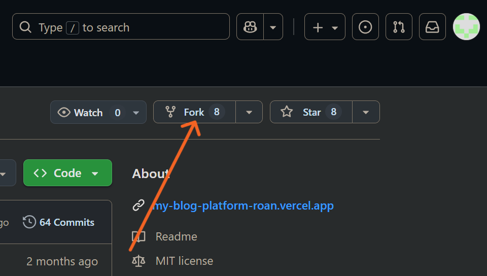
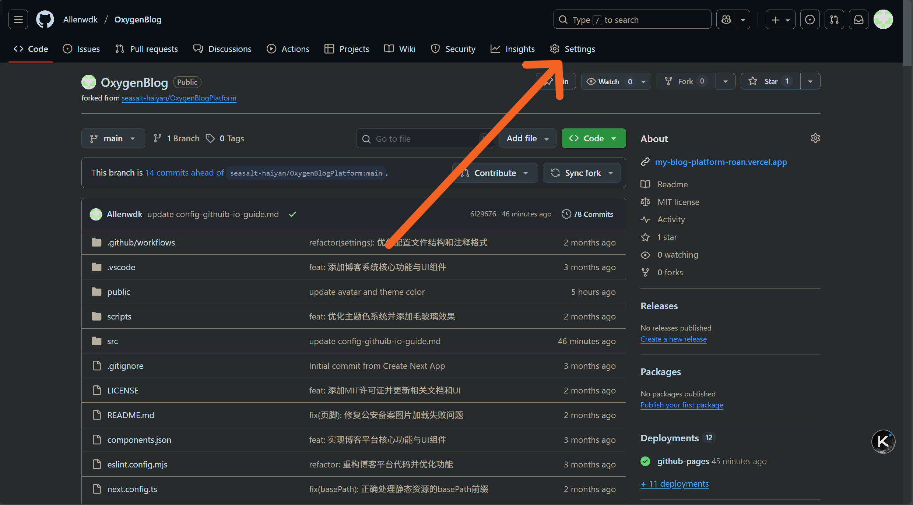
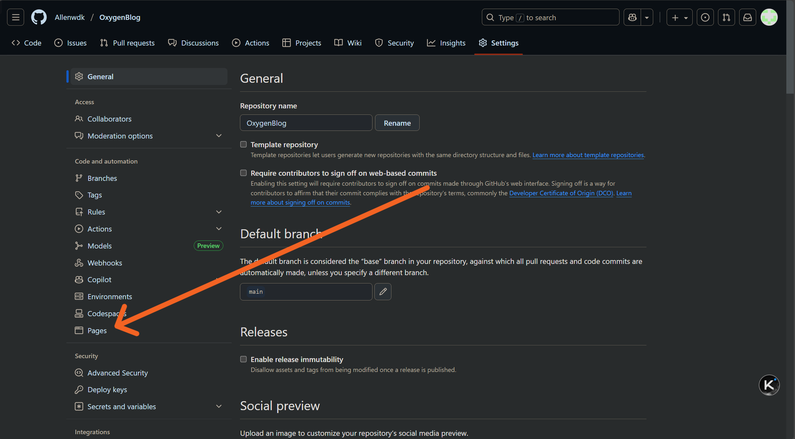
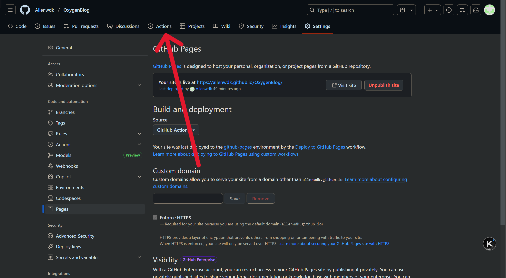
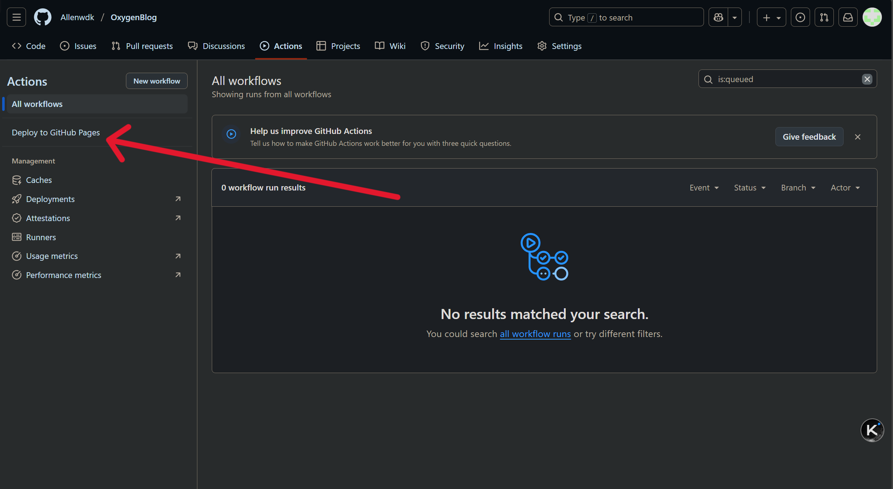

# 使用GitHub Action配置Oxygen Blog

## 准备工作

### （可选）安装加速器

1. 使用浏览器打开[Watt Toolkit官网](https://steampp.net/download)
2. 选择下载Windows版
3. 推荐使用蓝奏云下载
4. 安装
5. 打开安装的Watt Toolkit，在网络加速选项中勾选Github
6. 选择一键加速

### 注册/登录GitHub账户

#### 注册GitHub账户

1. 打开[Github](https://www.github.com)
2. 点击**Sign up**，在接下来的界面中选择**Create an account**
3. 输入你的**邮箱**、**密码**、**用户名***(不要使用中文)*，选择你的地区*（注：如果无法完成注册，可以尝试将地区设置为香港）*，完成注册流程
4. 注册完成后重新登陆

#### 登录GitHub账户

1. 打开[Github](https://www.github.com)
2. 点击**Sign in**，输入**用户名**、**密码**，完成登录

### Fork OxygenBlogPlatform

1. 打开[OxygenBlogPlatform项目主页](https://github.com/seasalt-haiyan/OxygenBlogPlatform)
2. 点击**Fork**，在接下来的界面中点击**Create fork**
   
3. 点击后将跳转到你自己的fork项目

## 开始部署

### 初次部署OxygenBlog

1. 点击**Settings**选择**Pages**
2. 将**Source**改为**Github Actions**
3. 在上方选择**Actions**
4. 选择**I understand my workflows, go ahead and enable them**
5. 在左侧**Actions**选项栏中选择**Deploy to GitHub Pages**
6. 在右侧单击**Run workflow**，在弹出菜单中选择**Run workflow**，刷新界面
7. ~~坐合放宽~~，等待约1min15s后刷新界面看到对勾即可完成部署

### 查看你的成果

1. 单击刚刚完成的**Deploy to Github Pages**
2. 在新打开的页面中右侧deploy下方显示的就是你的blog网址
3. 单击他，即可查看你的成果

## 客制化你的Blog

### 更换背景

1. 打开你刚才fork的项目，在下方文件列表中打开public文件夹
2. 单击右上方的Add file，选择upload files，将你准备好的背景图片上传
   注：可在这步同时上传你的头像在此目录，方便后续修改
3. 返回上一级，依次打开src/setting/WebSetting.ts
4. 单击右上角的笔🖊按钮，在第六行引号内修改文件名为你上传图片的名字（记得保留前面的/和后缀名）
5. 单击Commit changes...，在弹出界面中选择Commit changes
6. 稍等两分钟，刷新你的blog网站，即可看到焕然一新的背景

### 修改界面文案

#### 配置项简介（来自GitHub readme）

平台配置存放在 setting 文件夹中，即改即用：

```text
AboutSetting.ts // 关于页面的配置
blogSetting.ts // 博客页面的配置
FooterSetting.ts // 网站页脚配置
HomeSetting.ts // 主页配置
NavigationSetting.ts // 导航栏配置
WebSetting.ts // 网站配置
```

每一个配置文件都为您写好了注释。

#### 分步教学

##### 修改主页文本

1. 打开src/setting/HomeSetting.ts
2. 按照注释修改即可

##### 修改页脚文本

1. 打开src/setting/FooterSetting.ts
2. 按照注释修改

##### 修改导航栏文本

1. 打开src/setting/NavigationSetting.ts
2. 按照注释修改

##### 修改关于界面

1. 打开src/setting/AboutSetting.ts
2. 若在修改背景前已经上传头像，则继续下一步；若未上传，按照修改背景的教程进行上传
3. 在第8行修改引号内为你上传头像的文件名
4. 在第15行引号内修改名字，下一行修改宣言
5. 20行可自定义图云的图标
6. 53-55行可修改关于我界面的三行文字
7. 在61行修改邮箱为你自己的，格式为mailto:你的邮箱
8. 在62行将链接改为你的GitHub主页

##### 修改其他网页设置

###### 网站标题

在src/setting/WebSetting.ts的第2行设置

###### 增加/修改博客分类

在src/setting/blogSetting.ts第2行添加/删除

###### 文章底部作者名称和本文链接

在src/setting/blogSetting.ts第28行和30行修改

---

**修改完记得点击Commit change进行保存！**

---

## 上传文章

1. 所有文章均位于src/content/blogs目录下，按照不同类型的目录进行分类
2. 文章使用markdown格式
3. 在文章开头需加入以下元数据

```text
---
title: 使用Reference对象数组的示例文章 // 标题，不填写则为文件名
date: 2023-11-20 // 发布时间
category: 技术 // 分类
tags: [React, Next.js, TypeScript] // 标签，目前还不支持通过标签筛选
readTime: 5 // 阅读时间（选填）
excerpt: 这是一篇展示如何使用Reference对象数组格式的示例文章 // 摘要，显示在卡片上
reference: [ // 博文参考来源，可不配置
  { description: "Next.js官方文档", link: "https://nextjs.org/docs" },
  { description: "React官方文档", link: "https://reactjs.org/docs/getting-started.html" },
  { description: "TypeScript官方文档", link: "https://www.typescriptlang.org/docs/" },
  { description: "Tailwind CSS文档", link: "https://tailwindcss.com/docs" },
  { description: "MDN Web文档", link: "https://developer.mozilla.org/zh-CN/" }
]
---
```

## 写在最后

引用学长的一句话：

> 在技术的海洋中探索，在代码的世界里创造，用文字记录成长的足迹
